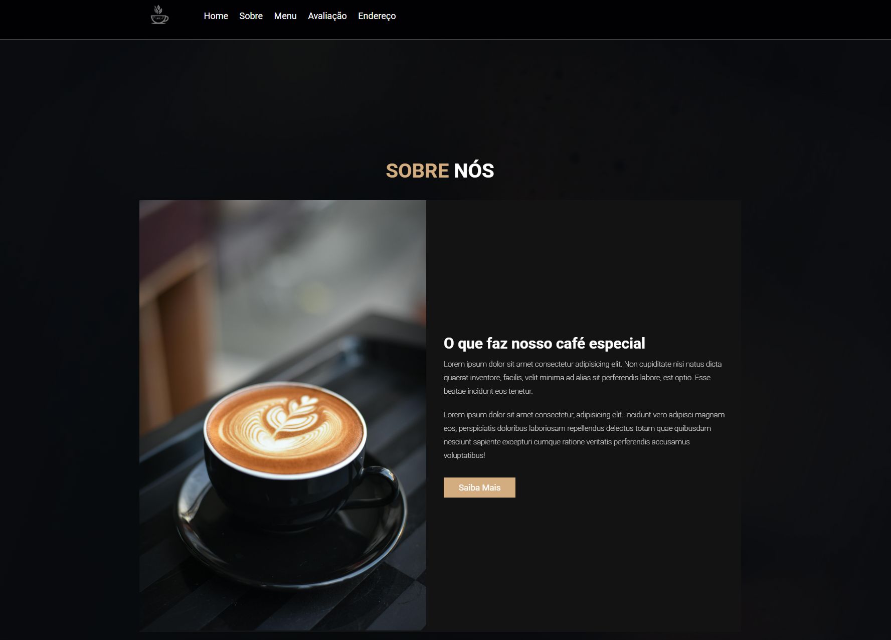

<h1 align="center"> Site Cafeteria </h1>

Site criado para vendas em forma de modelo. Contém margem para adiocionar inúmeras funcionalidades. 
 
<a href="https://lp.rocketseat.com.br/devlinks/inscricao?utm_source=github&utm_medium=descricao&utm_campaign=capture-devlinks&utm_term=organic&utm_content=descricao-github-mayk-brito">Faça um orçamento para seu site clicando aqui.</a>

  <a href="#-tecnologias">Tecnologias</a>&nbsp;&nbsp;&nbsp;|&nbsp;&nbsp;&nbsp;
  <a href="#-projeto">Projeto</a>&nbsp;&nbsp;&nbsp;|&nbsp;&nbsp;&nbsp;
  <a href="#-layout">Layout</a>&nbsp;&nbsp;&nbsp;|&nbsp;&nbsp;&nbsp;
  <a href="#memo-licença">Licença</a>

 

  

## 🚀 Tecnologias

Esse projeto foi desenvolvido com as seguintes tecnologias:

- HTML e CSS
- JavaScript
- Git e Github

## 💻 Projeto

O site foi criado para uma cafeteria, com um tema minimalista e aconchegante. O projeto contém funcionalidades inovadoras, criado com muito carinho e empenho. Funcionalidades práticas que facilitam o acesso e a práticidade do usário.

- [Acesse o projeto finalizado, online](https://lucasgribeiro7.github.io/Site-cafeteria)

## 🔖 Layout

Criado a partir de imagens livres de direitos autorais.

Feito com ♥ by Lucas Ribeiro
